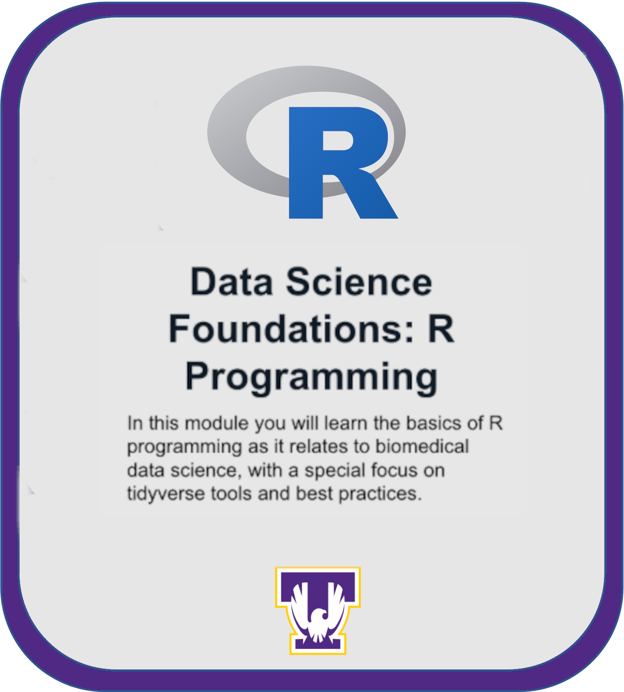

<p align="center">
    
</p>

## Overview

This repository contains materials for an introductory data science module, part of the NIH NIGMS sandbox initiative, designed for learners new to data science concepts and techniques. The module emphasizes practical applications using R programming and foundational statistical concepts, leveraging cloud computing on Google Cloud Platform (GCP) with Jupyter notebooks. Key topics include:

- Introduction to R programming.
- Tidyverse essentials, including data filtering with `dplyr`, data cleaning with `tidyr` and visualization with `ggplot2`.
- Fundamentals of statistical methods such as ANOVA and Linear Regression (LR).
- A primer on RNAseq data analysis.
- Introduction to [AI assistant within Jupyter](https://github.com/NIGMS/Data-Science-Foundations-in-R/blob/main/data_science_module_setup.md#ai-assistant)


## **Contents**

- [Background](#background)
- [Before Starting](#before-starting)
- [Getting Started](#getting-started)
- [Software Requirements](#software-requirements)
- [Architecture Design](#architecture-design)
- [Data](#data)
- [Funding](#funding)
- [License for Data](#license-for-data)
## Video Overview
<p align="center">
        <a href="https://www.youtube.com/watch?v=7XHhE6WxX60&list=PLXaEJPtnQ4w7Vu7vqWbttBjUGrPp4Qa7b&index=51">
        </a>
    <br>
    <span> <b>Click above image to watch overview video</b> </span>
</p>


## **Background**

Data science is a multidisciplinary field that uses statistical and computational tools to extract knowledge and insights from structured and unstructured data. This module introduces cloud computing concepts, demonstrating how modern data science workflows can benefit from scalable, cloud-based environments like Google Cloud Platform (GCP). This module is specifically tailored for beginners in biological and biomedical research but can benefit anyone seeking a foundational understanding of data science workflows.

## **Before Starting**

See instructions in our [set up submodule](https://github.com/NIGMS/Data-Science-Foundations-in-R/blob/main/data_science_module_setup.md) to configure your environment. 

## **Getting Started**

1. Clone this repository:
```bash
https://github.com/mitomac/duke_nigms_sandbox.git
```
2. Open the project in Jupyter Notebook.

3. Explore the Jupyter notebooks in the `notebooks` folder to follow along with each module. These notebooks leverage Google Cloud Platform (GCP) for cloud-based computation, ensuring scalability and accessibility for users.
   - `module0.ipynb`: Gen AI integration setup
   - `module1.ipynb`: Introduction to R
   - `module2.ipynb`: Introduction to ggplot2
   - `module3.ipynb`: Introduction to dplyr
   - `module4.ipynb`: Introduction to tidyr
   - `module5.ipynb`: Introduction to basic statistical concepts
   - `module5.ipynb`: Introduction to RNAseq
   - `module5.ipynb`: Introduction to DESeq2

## **Software Requirements**

- R version >= 4.0.0
- Jupyter Notebook installed
- Required R packages: `tidyverse`, `ggplot2`, `DESeq2`, `car`
- Jupyter Notebook for viewing `.ipynb` files (optional).

## **Architecture Design**

This module is organized into five core notebooks, each targeting a specific learning objective. These objectives are designed to align with the broader goals of introducing cloud computing and data science workflows, ensuring learners gain both theoretical understanding and practical skills.

- **Module 0**: Covers setting up a Vertex AI Workbench on Google Cloud Platform (GCP). This includes creating a Google Cloud account, enabling necessary APIs, and configuring a Jupyter Notebook environment for use in the cloud.
- **Module 1**: Covers basic R syntax, data structures, and fundamental programming concepts.
- **Module 2**: Introduces Tidyverse and `ggplot2` for creating impactful graphics.
- **Module 3**: Introduces `dplyr` for data filtering and manipulation. 
- **Module 4**: Introduces  `tidyr` for cleaning and formatting large datasets.
- **Module 5**: Focuses on statistical testing using ANOVA to understand group differences.
- **Module 6**: Covers sequence alignment for RNAseq data using Salmon, including transcript quantification and data preprocessing steps.
- **Module 7**: Provides an analysis of RNAseq data using DESeq2, including differential expression analysis and visualization techniques.

Each notebook contains example datasets and guided exercises to reinforce concepts.


## **Data**

The datasets used in this module are included within the repository in the `data/` folder. These include:

- Synthetic datasets for practicing R programming and statistical methods.
- A sample RNAseq dataset for illustrating data preprocessing and analysis techniques.

Ensure to set the working directory correctly to access these files.

## **Funding**

This module was developed with support from [insert funding source, e.g., NIH grant XYZ12345].

## **License for Data**

The datasets and code in this repository are licensed under the [Creative Commons Attribution 4.0 International (CC BY 4.0)](https://creativecommons.org/licenses/by/4.0/) license unless stated otherwise. Please attribute the authors when using or modifying these materials for your work.

---

Feel free to expand sections or customize based on specific needs for the module.


